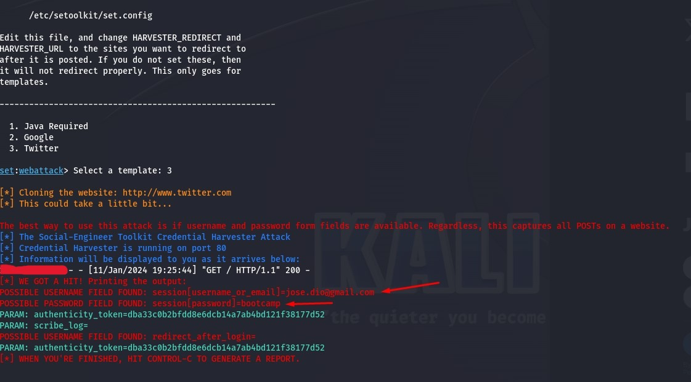

# Phishing para captura de senhas do Twitter

### Sistema Operacional
- Kali Linux

### Ferramenta
- Kit de Ferramentas (setoolkit)

### Step to Step

1. Acesso root: '''sudo su'''
2. Executando o setoolkit: '''setoolkit'''
3. Tipo de ataque: '''Social-Engineering Attacks'''
4. Vetor de ataque: '''Web Site Attack Vectors'''
5. Método de exploração: '''Credential Harvester Attack Method'''
6. Método de ataque: '''Web Templates'''
7. Templates: Twitter

### Resultados

